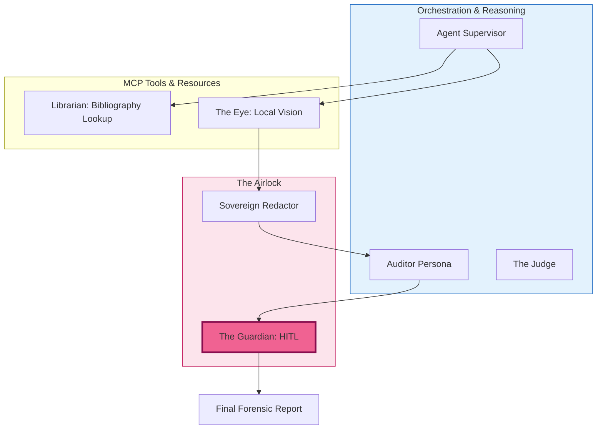

# MCP Forensic Analyser
### A Reference Implementation for Protocol-Driven AI Auditing

## 🗺️ The Sovereign Vault Journey
This repository is a companion to the **End of Glue Code** blog series. It demonstrates a **Secure-by-Design** architecture where sensitive data is processed locally before being analyzed by high-reasoning cloud models.

> **New here?** Start with our [WALKTHROUGH.md](./WALKTHROUGH.md) to see how each blog post maps to the code.

## 🏛️ Design Principles
This project illustrates five core patterns for modern AI systems:
1. **Local-First Perception:** Heavy visual processing happens on your metal, not in the cloud.
2. **Standardized Tool Discovery:** Agents dynamically discover capabilities via MCP—no custom "glue code" for every new tool.
3. **The Sovereign Airlock:** A multi-layered governance gate (Redactor + Guardian) that controls what leaves your network.
4. **Cognitive Budgeting:** Semantic routing that uses the most cost-effective model for the task.
5. **Evaluatable Intelligence:** An "LLM-as-a-Judge" framework to prove reliability through data, not "vibes".

## 🐍 Why TypeScript + Python?
We use a **Polyglot Architecture** to mirror real-world enterprise environments:
- **TypeScript (MCP Server):** Ideal for defining the MCP lifecycle, strictly-typed schemas (Zod), and high-performance server-side logic.
- **Python (Orchestrator):** The industry standard for agentic frameworks, data science, and local SLM interaction (Ollama/Presidio).

### ⚡ 5-Minute Demo
See the "Sovereign Vault" in action with a pre-configured audit:
```bash
# Analyze a sample artifact locally using the quick-start script
python examples/quick_start.py --artifact ./test_images/sample.jpg
```

---

## Architecture




---

The **MCP Forensic Analyser** is a Model Context Protocol (MCP) server designed to facilitate deep-dive archival audits and metadata reconciliation. Built as the cornerstone of the [End of Glue Code series](LINK_TO_YOUR_BLOG), it demonstrates how to move from brittle API integrations to a standardized, discovery-based AI architecture. 

Rare book authentication is our primary case study, used to demonstrate a universal AI Forensic Architecture.

## 🏛️ Architecture: The "Zero-Glue" Stack
Unlike traditional integrations, this server allows any MCP-compatible agent (Claude, Oracle 26ai, local SLMs) to dynamically discover forensic tools without custom code.

The project follows an Enterprise AI Mesh pattern, decoupling intelligence (Agents) from capability (MCP Servers). It is designed to scale from a local 'Forensic Clean-Room' to an enterprise-grade governed environment using Oracle 26ai for immutable audit trails and row-level security.

## ⚖️ Reliability & Observability
We move beyond 'vibe-checking' agents by implementing an **LLM-as-a-Judge** framework.
- **Golden Dataset:** A ground-truth set of forensic cases used to benchmark agent performance.
- **Automated Evaluation:** Every architectural change is audited by a high-reasoning 'Judge Agent' to ensure zero regression in forensic accuracy.
- **Structured Logging:** All provider errors and reasoning chains are captured for post-mortem analysis, moving away from silent failures.

## 👁️ Local Multimodal Vision (Post 3.1)
The analyzer uses **Llama 3.2-Vision** via Ollama to perform local OCR and physical artifact inspection. This ensures that high-resolution images of sensitive documents never leave your local "Clean Room."

- **Capabilities:** Handwriting transcription, paper aging analysis, and title page layout verification.
- **Latency Note:** Local vision on CPU is resource-intensive. The system defaults to a **300s timeout** to accommodate deep forensic scans.
- **Configuration:** Ensure Ollama is running `llama3.2-vision` (or a similar multimodal model).

## 🛡️ The Redactor (Post 3.2)

## 🛡️ The Redactor (Post 3.2 — PII Scrubbing)
The **Sovereign Redactor** implements a "Cloud-Agnostic" security airlock. It automatically scrubs PERSON, LOCATION, and ORGANIZATION entities from vision context before cloud egress.

- **Secure by Default:** Any provider not explicitly marked as `LOCAL` (e.g., Anthropic, OpenAI) triggers mandatory redaction.
- **Precision Shield:** Uses an **Allow-list** (Title, Author, Publisher) to preserve forensic metadata while hiding PII.
- **Fault Tolerance:** Implements a sentinel-based "Safe-Fail" pattern—if the NLP engine fails to load, the system warns the user and continues the audit unredacted rather than crashing.

**Setup:**
```bash
# Uncomment the PII section in examples/requirements.txt, then:
pip install -r examples/requirements.txt
python -m spacy download en_core_web_lg
```

The orchestrator lazily loads the Redactor; if dependencies are missing, cloud runs proceed without PII scrubbing. See `examples/redactor.py`.

## 🛡️ Human-in-the-Loop (The Guardian)
The orchestrator implements **Governance** for high-stakes findings:
- **Trigger:** When the Analyst identifies a HIGH severity discrepancy, the report is not finalized immediately.
- **Handshake:** The user is prompted: *Do you authorize this forensic finding? (yes/no)*.
- **Governance:** If *yes*, the finding is finalized. If *no*, it is flagged `DISPUTED_BY_HUMAN` and moved to "Requires Further Investigation".
- Use `--no-guardian` to skip for CI or non-interactive runs (e.g. evaluator).

## 💰 Cognitive Budgeting (The Accountant)
To manage enterprise scale, we implement **Semantic Routing**:
- **Tiered Intelligence:** Requests are classified by complexity. Simple tasks are routed to local SLMs (Phi-4/Llama 3.2), while complex forensic tasks are escalated to Claude 3.5.
- **Cost Optimization:** This approach reduces inference costs by up to 80% without sacrificing high-end reasoning where it matters.

> **Architect’s Summary:** This implementation solves the three "Last Mile" problems of enterprise AI: Standardization (via MCP), Reliability (via automated LLM-as-a-Judge), and Sustainability (via Tiered Intelligence Routing). It transitions AI from brittle, high-cost experiments to governed, cost-optimized infrastructure.

## 🛠️ Features
- **Discovery-First:** Implements the full MCP Lifecycle (Handshake -> Manifest -> Execution).
- **Archival Tools:** Specialized functions for metadata cross-referencing and watermark verification.
- **Polyglot Ready:** Built in TypeScript, designed to be orchestrated by Python-based agentic frameworks.

## ⚙️ Configuration & Prompts
Agent logic is decoupled from the execution engine. System instructions are managed in `config/prompts.yaml`, allowing for A/B testing of prompt versions and model-specific tuning without redeploying code.

## 🚀 Quick Start

### Installation
```bash
npm install
npm run build
```

## 🏠 Edge AI: Running Locally with SLMs
This branch demonstrates the "Forensic Clean-Room" setup, moving inference from the cloud to your local machine.

### Prerequisites
1. **Ollama:** [Download and install Ollama](https://ollama.com/).
2. **Model:** Pull the default model (or another of your choice):
   ```bash
   ollama pull llama3.2
   ```
   The orchestrator defaults to `llama3.2`; for other models (e.g. phi4), set `LLM_MODEL` (see below).

### Running the Local Orchestrator
To run the multi-agent team using the local SLM:

```bash
python examples/orchestrator.py --provider ollama
```

To use a different model or Ollama host, set the environment variables:
```bash
LLM_MODEL=phi4 python examples/orchestrator.py --provider ollama
OLLAMA_HOST=http://192.168.1.10:11434 python examples/orchestrator.py --provider ollama
```

### Environment Variables
| Variable | Description | Default |
|---|---|---|
| `OLLAMA_VISION_TIMEOUT_MS` | Timeout for local vision processing | `300000` (5 mins) |
| `PII_REDACTION_ENABLED` | Toggle the Sovereign Redactor | `true` |

> Note: SLMs require explicit instruction tuning. The orchestrator includes an optimized system prompt to help small models handle MCP JSON schemas effectively.

### Running The Judge
```bash
python examples/evaluator.py
```

### Running with The Accountant (Semantic Router)
Route requests by complexity to save budget—simple queries use local SLMs, complex forensic tasks use cloud models:

```bash
python examples/router.py --query "Look up The Hobbit" --title "The Hobbit" --author "Tolkien"
python examples/orchestrator.py --use-accountant --query "Compare points of issue and binding across editions" --title "The Great Gatsby"
```

Configure routing via `ACCOUNTANT_MODEL` (classification model), `ACCOUNTANT_CLASSIFICATION_PROVIDER` (default: ollama; use `lm_studio` if only LM Studio available), `ACCOUNTANT_LEVEL_1_PROVIDER`, `ACCOUNTANT_LEVEL_2_PROVIDER`.
