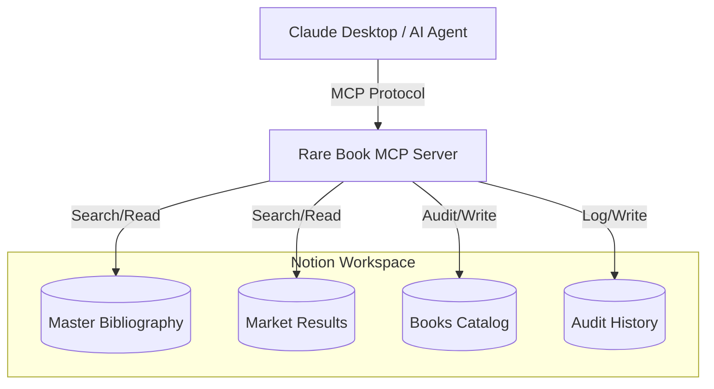

<p align="center">
  
</p>

# Archival Intelligence
### Proprietary Forensic Engine for Abiqua Archive

**A Forensic Audit & Valuation Engine for High-Value Bibliographic Assets**

Built for the **2026 Notion MCP Hackathon**, this server transforms a standard Notion workspace into a professional rare book "Forensic Lab." It bridges structured archival data with LLM reasoning to identify forgeries, state-variants, and $10,000+ market discrepancies.

---

## 🚩 The Problem
High-value rare book trade relies on **"Points of Issue"**—tiny typographic or physical variations (like a single letter typo in a 19th-century poem) that determine if a book is worth $50,000 or $500. Non-experts often miss these "Ground Truth" markers, leading to massive financial loss and authenticity risks.

## 🛡️ The Solution
This Model Context Protocol (MCP) server enables AI Agents (like Claude Desktop) to:

1.  **Sync with Ground Truth:** Query a private "Master Bibliography" for definitive state-markers.
2.  **Perform Forensic Audits:** Compare physical observations against archival standards.
3.  **Capture Market Signals:** Pull recent "Hammer Prices" to contextualize risk.
4.  **Automate Governance:** Update item statuses and maintain a permanent **Audit Log** in Notion.
5.  **Relational Provenance:** Automatically create "Two-Way Relations" between inventory and audit logs.

> [!IMPORTANT]
> **High-Value Use Case:** While many MCP servers focus on general productivity, this project addresses the specific, high-stakes requirements of **Asset Governance**. By automating the forensic audit trail, we eliminate human error in identifying 1st-state variants.

---

## 🏛️ Why Notion?
This project leverages Notion not just as a database, but as a **relational engine**. By linking Inventory, Bibliographic Standards, and Audit Logs, we create a **'Single Source of Truth'** for asset provenance that is impossible to achieve with flat-file AI tools.

### System Architecture



## Relational Architecture

Unlike standalone bots, this system utilizes a Relational Graph architecture. Every audit creates a permanent, immutable link between the *Inventory* (`Books Catalog`) and the *Evidence* (`Audit History`), ensuring a verifiable chain of custody for high-value assets. When an audit fails, the system doesn't just create a log; it back-links that log to the specific Catalog page, creating a 360-degree view of the asset's forensic history directly within the Notion UI.

---

## Features & Tools

| Tool | Function | Enterprise Impact |
| :--- | :--- | :--- |
| `find_book_in_master_bibliography` | Cross-references archival standards. | Eliminates human memory errors. |
| `audit_artifact_consistency` | Identifies "Point of Issue" mismatches. | Prevents high-value forgeries. |
| `update_book_status` | Direct write-back to Notion Inventory. | Real-time inventory governance. |
| `create_audit_log` | Records timestamped audit results. | Chain of Custody & Provenance. |

> [!TIP]
> **Forensic Logic & Limitations**
>
> - **Matching Engine:** The `audit_artifact_consistency` tool uses one-directional substring matching: the observed value must contain the full expected standard. This prevents vague observed strings from falsely suppressing High-severity discrepancies.
> - **Knowledge Boundary:** The system's expertise is strictly bound to the Master Bibliography. If a title is not present in the reference database, the agent will correctly report a lack of ground-truth data rather than hallucinating.


---

## Installation & Setup

1. **Clone & Install:**
   ```bash
   git clone https://github.com/kenwalger/Notion_MCP_Challenge_2026
   npm install
   npm run build
   ```

2. **Notion Setup:** Duplicate the [Abiqua Archive: Forensic Asset Vault](https://achieved-wedge-edc.notion.site/Abiqua-Archive-Forensic-Asset-Vault-31aac0eb355080688b33ede2be9fd70f) and configure `.env`:
   - `NOTION_API_KEY` – Integration token
   - `NOTION_BOOKS_DATABASE_ID`, `NOTION_MASTER_BIBLIOGRAPHY_DATABASE_ID`, `NOTION_MARKET_RESULTS_DATABASE_ID`, `NOTION_AUDIT_LOG_DATABASE_ID`

3. **Claude Desktop Integration:** Add the absolute path to `dist/index.js` in your `claude_desktop_config.json`.


### ✅ Quality Assurance
This project includes a suite of unit tests built with Vitest to ensure the forensic logic remains sound even without a live Notion connection. Run them with:

```bash
npm test
```

---

## Reproducibility

To reproduce the forensic results shown in the video, we have provided a full set of [Sample Data](sample_data/). These CSVs can be imported directly into Notion to instantly recreate the Master Bibliography and Market Result databases used for the Alice, Hobbit, and Gatsby audits.

### Try the Forensic Suite

To see the relational logic in action, follow the guided test cases in [prompts.md](prompts.md). These cover three high-stakes forensic scenarios: *Alice's Adventures in Wonderland*, *The Hobbit*, and *The Great Gatsby*.

---

> [!CAUTION]
> Archival Intelligence is an MCP-based decision-support tool. Valuations are based on connected sample databases and historical auction results. Professional physical appraisal is always required for high-value asset transactions.

---

⚖️ License
Distributed under the MIT License. See [LICENSE](LICENSE) for more information.

Copyright (c) 2026 Ken W. Alger and the [Abiqua Archive](https://www.abiquaarchive.com).